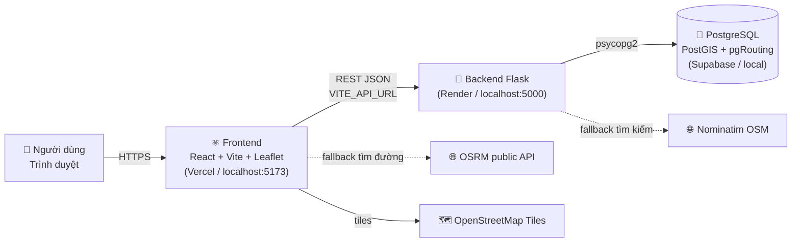
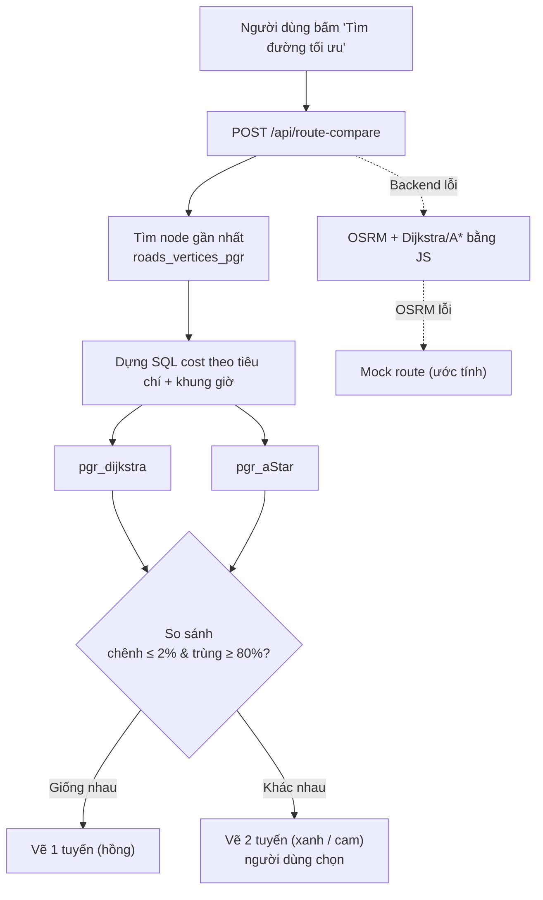

<div align="center">

# 🗺️ WebGIS HCM — RouteIQ

### Bản đồ thông minh tìm đường & phân tích giao thông TP. Hồ Chí Minh

Tìm đường tối ưu theo **quãng đường · thời gian · kẹt xe · tai nạn · hạ tầng**, so sánh **Dijkstra vs A\***, và tra cứu thông tin từng tuyến đường ngay trên bản đồ.


</div>

---

## 📑 Mục lục

1. [Giới thiệu](#-giới-thiệu)
2. [Tính năng nổi bật](#-tính-năng-nổi-bật)
3. [Kiến trúc hệ thống](#-kiến-trúc-hệ-thống)
4. [Công nghệ sử dụng](#-công-nghệ-sử-dụng)
5. [Cấu trúc thư mục](#-cấu-trúc-thư-mục)
6. [Cơ sở dữ liệu](#-cơ-sở-dữ-liệu)
7. [Thuật toán tìm đường](#-thuật-toán-tìm-đường)
8. [Tài liệu API](#-tài-liệu-api)
9. [Cài đặt & chạy local](#-cài-đặt--chạy-local)
10. [Biến môi trường](#-biến-môi-trường)
11. [Triển khai production](#-triển-khai-production)
12. [Hướng dẫn sử dụng](#-hướng-dẫn-sử-dụng)
13. [Cơ chế dự phòng (Fallback)](#-cơ-chế-dự-phòng-fallback)
14. [Xử lý sự cố](#-xử-lý-sự-cố)
15. [Hạn chế đã biết & định hướng](#-hạn-chế-đã-biết--định-hướng)

---

## 🌟 Giới thiệu

**WebGIS HCM (RouteIQ)** là ứng dụng bản đồ web dành cho TP. Hồ Chí Minh, kết hợp dữ liệu không gian (PostGIS) và thuật toán đồ thị (pgRouting) để giúp người dùng:

- Tìm đường đi **không chỉ ngắn nhất** mà còn **ít kẹt xe**, **ít tai nạn**, **hạ tầng tốt**.
- Quan sát các lớp dữ liệu giao thông thực tế: **đường, kẹt xe theo khung giờ, điểm tai nạn, biển báo**.
- **Click vào bất kỳ đâu** trên bản đồ để xem hồ sơ chi tiết của tuyến đường gần nhất.

Dự án phù hợp cho nghiên cứu khoa học (NCKH), đồ án GIS, và làm nền tảng cho các hệ thống dẫn đường thông minh.

---

## ✨ Tính năng nổi bật

### 🧭 1. Tìm đường đa tiêu chí

| Tiêu chí | Mô tả | Trọng số tai nạn (`aw`) | Trọng số kẹt xe (`tw`) |
|---|---|:---:|:---:|
| 📏 Đường ngắn nhất | Tối thiểu khoảng cách | 0.0 | 0.0 |
| ⚡ Thời gian nhanh nhất | Ưu tiên tránh đoạn chậm | 0.0 | 1.5 |
| 🚦 Ít kẹt xe nhất | Tránh mật độ cao theo giờ | 0.0 | 2.5 |
| 🛡️ Ít tai nạn nhất | Tránh điểm đen | 3.0 | 0.5 |
| 🏗️ Cơ sở hạ tầng | Cân bằng tai nạn và kẹt xe | 0.5 | 0.5 |

Hỗ trợ **4 phương tiện**: 🏍️ Xe máy · 🚗 Ô tô · 🚶 Đi bộ · 🚌 Xe buýt.

| Phương tiện | Tốc độ TB | Tốc độ tối đa |
|---|:---:|:---:|
| Xe máy | 28 km/h | 60 km/h |
| Ô tô | 32 km/h | 80 km/h |
| Đi bộ | 5 km/h | 8 km/h |
| Xe buýt | 18 km/h | 40 km/h |

### ⚔️ 2. So sánh Dijkstra vs A\*

Backend chạy **cả hai thuật toán** cùng lúc trên cùng bảng cost:

- Nếu chênh lệch quãng đường **≤ 2%** và tỉ lệ đường trùng **≥ 80%** → trả về **một** tuyến (màu hồng).
- Ngược lại → vẽ **hai** tuyến (🔵 Dijkstra, 🟠 A\*) và để người dùng **chọn tuyến**.

### 🔎 3. Xem thông tin tuyến đường (Road Info)

Bật chế độ **"Thông tin đường"**, click lên bản đồ để xem, gom nhóm theo chủ đề:

| Nhóm | Nội dung |
|---|---|
| 🔴 Tai nạn giao thông | Tần suất, loại va chạm, mức độ, khung giờ |
| 🟡 Tình trạng giao thông | Mức ùn tắc, khung giờ kẹt, tốc độ min/max |
| 🔵 Cơ sở hạ tầng | Địa hình, số làn, chiều lưu thông, chiều rộng |
| 🟢 Môi trường đường | Ánh sáng, ngập, ổ gà, giao lộ |
| 🟣 Biển báo | Loại biển, phương tiện áp dụng |

Mã số trong DB được **tự động chuyển sang tiếng Việt** (ví dụ `terrain = 5` → *"Đường cao tốc"*).

### 🗂️ 4. Các lớp bản đồ (Layers)

| Layer | Hiển thị | Ghi chú |
|---|---|---|
| 🛣️ Đường | Polyline xanh đậm, hover cam | Click xem popup thuộc tính |
| 🚦 Kẹt xe | Polyline theo 4 mức: vàng → cam → đỏ → đỏ đậm | Theo giờ hiện tại |
| ⚫ Tai nạn | Chấm đen, kích thước theo mức độ | Popup: tần suất, loại, khung giờ |
| 🟡 Biển báo | Chấm vàng | Popup: loại biển, phương tiện |

### 📍 5. Trải nghiệm dẫn đường

- Autocomplete địa điểm (DB → Nominatim → danh sách 30 địa danh nội bộ, **hỗ trợ tìm không dấu**).
- Chọn điểm bằng **click bản đồ**, kéo thả marker, hoặc dùng **vị trí GPS**.
- Nút **đảo chiều** ⇅ điểm đi/đến.
- Hướng dẫn **từng bước** (step-by-step) với nút ‹ ›.
- **GPS realtime** (`watchPosition`): cập nhật quãng đường/thời gian còn lại, tự chuyển bước.
- **Cảnh báo điểm tai nạn** nằm trong bán kính 1 km quanh tuyến (marker nhấp nháy).
- Sidebar có thể thu gọn; thông báo toast; banner cảnh báo khi DB mất kết nối.

---

## 🏛️ Kiến trúc hệ thống



### Luồng tìm đường



---

## 🧰 Công nghệ sử dụng

| Tầng | Công nghệ | Phiên bản |
|---|---|---|
| Frontend | React, ReactDOM | ^18.3.1 |
| Bản đồ | Leaflet | ^1.9.4 |
| Build tool | Vite, `@vitejs/plugin-react` | ^5.4.0, ^4.3.1 |
| Backend | Flask, Flask-CORS | 3.0.3, 4.0.1 |
| DB driver | psycopg2-binary | 2.9.10 |
| HTTP client | requests | 2.31.0 |
| WSGI server | gunicorn | 23.0.0 |
| Cơ sở dữ liệu | PostgreSQL + **PostGIS** + **pgRouting** | PostgreSQL 18 (khuyến nghị) |
| Dịch vụ ngoài | OpenStreetMap tiles, Nominatim, OSRM | — |

---

## 📁 Cấu trúc thư mục

```text
GIS_WEB_HCM/                              # Thư mục gốc repo
├── README.md                             # Tài liệu này
├── package-lock.json                     # (file lock rỗng ở gốc, không dùng)
├── .idea/                                # Cấu hình IDE (JetBrains)
│
└── WEBGIS_HCM-final/                     # ⭐ Toàn bộ mã nguồn dự án
    │
    ├── index.html                        # Điểm vào HTML của Vite
    ├── package.json                      # Dependencies & scripts frontend
    ├── package-lock.json
    ├── vite.config.js                    # Cấu hình Vite (port 5173, tự mở trình duyệt)
    ├── eslint.config.js                  # Cấu hình ESLint
    ├── env.example                       # Mẫu biến môi trường
    ├── .gitignore
    ├── KIEM_TRA_DATABASE.bat             # Script Windows chẩn đoán DB
    ├── HUONG_DAN.md                      # Hướng dẫn cài đặt & chạy
    ├── HUONG_DAN_FIX.md                  # Hướng dẫn sửa lỗi kết nối DB
    │
    ├── public/
    │   └── icons/
    │       ├── start.png                 # Icon điểm xuất phát
    │       └── end.png                   # Icon điểm đến
    │
    ├── backend/                          # 🐍 API Flask
    │   ├── app.py                        # Toàn bộ API + logic routing + convert dữ liệu
    │   ├── kiem_tra_db.py                # Script chẩn đoán kết nối / bảng / geometry
    │   ├── start_backend.bat             # Khởi động backend nhanh trên Windows
    │   ├── requirements.txt              # Thư viện Python
    │   └── env.example                   # Mẫu biến môi trường (Vercel)
    │
    └── src/                              # ⚛️ Mã nguồn frontend
        ├── main.jsx                      # Mount React vào #root
        ├── App.jsx                       # State toàn cục, toast, kiểm tra DB, điều phối
        ├── config.js                     # API_URL (đọc VITE_API_URL)
        ├── styles.css                    # Biến CSS & style chung
        │
        ├── components/
        │   ├── Sidebar.jsx               # Form điểm đi/đến, phương tiện, tiêu chí, layer
        │   ├── MapView.jsx               # Bản đồ Leaflet, layers, routing, GPS, cảnh báo
        │   ├── RouteInfo.jsx             # Bảng hướng dẫn từng bước + so sánh 2 thuật toán
        │   ├── RoadInfoPanel.jsx         # Panel thông tin tuyến đường khi click
        │   ├── LayerToggle.jsx           # Công tắc bật/tắt các layer
        │   └── Loading.jsx               # Overlay loading
        │
        ├── services/
        │   ├── routeService.js           # Gọi /api/route, /api/route-compare, OSRM, mock
        │   ├── roadInfoService.js        # Gọi /api/road-info
        │   └── geocodeService.js         # Tìm địa điểm: backend → local (không dấu)
        │
        ├── hooks/
        │   └── useGeolocation.js         # Promise hóa navigator.geolocation
        │
        ├── utils/
        │   ├── graphSearch.js            # Dijkstra & A* thuần JS + MinHeap + haversine
        │   ├── routeMock.js              # Hằng số: tốc độ xe, tiêu chí, format
        │   └── icons.jsx                 # Bộ icon SVG
        │
        └── data/                         # Dữ liệu tĩnh dự phòng khi backend offline
            ├── roads.json
            ├── accidents.json
            ├── traffic.json
            └── traffic_signs.json
```

### Vai trò từng lớp

| Thư mục | Trách nhiệm |
|---|---|
| `backend/` | Kết nối DB, chạy truy vấn không gian, tính đường, chuẩn hóa dữ liệu trả về |
| `src/components/` | Giao diện và tương tác với bản đồ |
| `src/services/` | Toàn bộ lời gọi mạng (tách khỏi component) |
| `src/utils/` | Hàm thuần: thuật toán, hằng số, icon |
| `src/data/` | Bản sao dữ liệu tĩnh để app vẫn chạy khi backend offline |

---

## 🗄️ Cơ sở dữ liệu

- **Tên DB:** `nckh_hcm`
- **Yêu cầu extension:** `postgis`, `pgrouting`
- **Khôi phục từ file backup** `data.backup` (định dạng custom của `pg_dump`; file này cần được cung cấp riêng, không nằm trong repo).

### Các bảng chính

| Bảng | Cột quan trọng | Mô tả |
|---|---|---|
| `roads` | `road_id`, `ward_id`, `road_name`, `geom`, `length_m`, `road_width`, `lane_count`, `direction`, `terrain`, `road_condition`, `lighting`, `flooding_level`, `main_vehicle[]`, `source`, `target` | Các đoạn đường + đồ thị routing |
| `accidents` | `accident_id`, `road_id`, `accident_frequency`, `accident_type[]`, `severity`, `time_window[]`, `geom` | Điểm tai nạn |
| `traffic_conditions` | `traffic_id`, `road_id`, `traffic_time_window[]`, `congestion_level[]`, `speed_min`, `speed_max` | Kẹt xe theo khung giờ |
| `road_features` | `road_id`, `potholes`, `many_intersections`, `near_intersection`, `surface_condition` | Đặc điểm mặt đường |
| `traffic_signs` | `sign_id`, `road_id`, `sign_type[]`, `applicable_vehicle[]`, `geom` | Biển báo |
| `routing_weights` | `road_id`, `accident_weight`, `congestion_weight`, `flooding_weight`, `sign_penalty`, `total_cost` | Trọng số routing |
| `wards` | `ward_id`, `ward_name`, `geom` | Phường/xã |
| `roads_vertices_pgr` | `id`, `geom` | Các nút của đồ thị pgRouting |

### Bảng mã → tiếng Việt (trích)

| Trường | Giá trị |
|---|---|
| `severity` / `congestion_level` | 1 Nhẹ · 2 Trung bình · 3 Nặng |
| `time_window` (tai nạn) | 1 Sáng · 2 Trưa · 3 Chiều · 4 Tối |
| `traffic_time_window` | 1–4 Kẹt sáng/trưa/chiều/tối · 5 Không kẹt |
| `accident_type` | 1 Xe máy–Xe máy · 2 Xe máy–Ô tô · 3 Ô tô–Ô tô |
| `direction` | 1 Một chiều · 2 Hai chiều |
| `lighting` | 1 Có đèn · 2 Không có đèn |
| `flooding_level` | 1 Không ngập · 2 Thấp · 3 Trung bình · 4 Cao |
| `terrain` | 1 Phẳng · 2 Dốc nhẹ · 3 Phố đi bộ · 4 Kênh rạch · 5 Cao tốc · 6 Chợ/TTTM · 7 Ngập lụt · 8 Công trình · 9 Đang xây lại |
| `sign_type` | 1 Tốc độ · 2 Nguy hiểm · 3 Cấm · 4 Hiệu lệnh · 5 Chỉ dẫn · 6 Phụ · 7 Một chiều |

---

## 🧮 Thuật toán tìm đường

### 1. Chọn nút gần nhất

Điểm đi/đến được gắn vào nút đồ thị gần nhất bằng toán tử khoảng cách KNN của PostGIS (`geom <-> point`) trên bảng `roads_vertices_pgr`.

### 2. Hàm chi phí cạnh

Với mỗi đoạn đường `r`, tại khung giờ `slot`:

```text
cost = length_m
     + accident_weight × aw
     + congestion_level[slot] × length_m × tw × 0.01
```

(giá trị tối thiểu 0.001 để tránh cost bằng 0; đồ thị **vô hướng**, `cost = reverse_cost`)

### 3. Khung giờ (`slot`)

| Giờ | Slot |
|---|:---:|
| 06:00 – 08:59 | 0 |
| 09:00 – 14:59 | 1 |
| 15:00 – 18:59 | 2 |
| 19:00 – 23:59 | 3 |
| 00:00 – 05:59 | 4 |

### 4. Thời gian dự kiến

```text
durationS = (distanceM / 1000) / tốc_độ_TB_phương_tiện × 3600
```

> SQL cost được nhúng **inline** vào `pgr_dijkstra` / `pgr_aStar` (dollar-quoting), vì pgRouting chạy SQL trong executor riêng nên **không nhìn thấy TEMP TABLE** của session bên ngoài.

---

## 🔌 Tài liệu API

Base URL local: `http://localhost:5000`

| Method | Endpoint | Mô tả |
|:---:|---|---|
| GET | `/api/health` | Kiểm tra DB, đếm số đường/nút/tai nạn/kẹt xe |
| GET | `/api/db-status` | Số bản ghi mỗi bảng và số geometry hợp lệ |
| GET | `/api/search?q=&limit=` | Tìm địa điểm (DB `roads` → Nominatim) |
| POST | `/api/route` | Tìm đường bằng Dijkstra |
| POST | `/api/route-compare` | Chạy Dijkstra **và** A\*, so sánh |
| POST | `/api/road-info` | Thông tin tuyến đường tại tọa độ click |
| GET | `/api/roads` | Toàn bộ đoạn đường (GeoJSON + thuộc tính) |
| GET | `/api/accidents` | Toàn bộ điểm tai nạn |
| GET | `/api/traffic_signs` | Toàn bộ biển báo |
| GET | `/api/traffic?hour=8` | Mức kẹt xe theo giờ |

### `POST /api/route` · `/api/route-compare`

**Request**

```json
{
  "from": { "lat": 10.7722, "lng": 106.6983 },
  "to":   { "lat": 10.7951, "lng": 106.7218 },
  "vehicle": "motorbike",
  "criteria": "safety",
  "hour": 8
}
```

- `vehicle`: `motorbike` | `car` | `walk` | `bus`
- `criteria`: `shortest` | `fastest` | `traffic` | `safety` | `infrastructure`

**Response `/api/route-compare` — hai thuật toán giống nhau**

```json
{
  "same": true,
  "diffPct": 0.0,
  "reason": "Hai thuật toán cho cùng kết quả (chênh 0.0%)",
  "route": {
    "distanceM": 4210.5,
    "durationS": 541.3,
    "speedKmh": 28,
    "coordinates": [[10.77, 106.69], "..."],
    "steps": [{ "dir": "start", "label": "Xuất phát", "name": "Lê Lợi", "dist": 0 }],
    "roadNames": ["Lê Lợi", "Nguyễn Huệ"],
    "source": "dijkstra"
  },
  "astarAvailable": true
}
```

**Response — khác nhau:** trả `same: false`, `diffPct`, `roadOverlap`, cùng hai đối tượng `dijkstra` và `astar`.

### `POST /api/road-info`

```json
{ "lat": 10.7769, "lng": 106.7009, "radius": 150 }
```

Thuật toán tìm đoạn gần nhất: `ST_DWithin` với bán kính **r → 2r → 5r → 1 km → 2 km**, lấy đoạn gần nhất, sau đó gom tất cả đoạn **cùng tên đường** và JOIN 5 bảng (`accidents`, `traffic_conditions`, `road_features`, `traffic_signs`, `wards`).

Phản hồi gồm `found`, `road_name`, `ward`, `dist_m`, `all_segments`, `display` (nhãn tiếng Việt) và `raw` (giá trị gốc).

### Mã lỗi

| Mã | Ý nghĩa |
|:---:|---|
| 400 | Thiếu tọa độ |
| 404 | Không tìm thấy node / đường đi |
| 500 | Lỗi server |
| 503 | Không kết nối được DB (các endpoint layer) |

---

## 🚀 Cài đặt & chạy local

### Yêu cầu

- **Node.js** ≥ 18
- **Python** ≥ 3.9
- **PostgreSQL** kèm **PostGIS** và **pgRouting**
- File `data.backup` (bản sao lưu DB `nckh_hcm`)

### Bước 1 — Khôi phục cơ sở dữ liệu

```bash
# Tạo DB
psql -U postgres -c "CREATE DATABASE nckh_hcm;"

# Khôi phục dữ liệu
pg_restore -U postgres -d nckh_hcm data.backup
```

Hoặc khôi phục kèm tạo DB:

```bash
pg_restore -U postgres -d postgres --create -F c data.backup
```

### Bước 2 — Chạy Backend

```bash
cd WEBGIS_HCM-final/backend
pip install -r requirements.txt
python app.py
```

Trên Windows có thể chạy nhanh `backend/start_backend.bat`.

Kiểm tra: mở <http://localhost:5000/api/health> — kết quả mong đợi:

```json
{ "status": "ok", "db": "nckh_hcm", "roads": 0, "nodes": 0, "accidents": 0, "traffic": 0 }
```

(các con số sẽ là số bản ghi thực tế trong DB của bạn)

### Bước 3 — Chạy Frontend

```bash
cd WEBGIS_HCM-final
npm install
npm run dev
```

Mở <http://localhost:5173>.

### Scripts frontend

| Lệnh | Tác dụng |
|---|---|
| `npm run dev` | Chạy dev server (HMR) tại cổng 5173 |
| `npm run build` | Build production ra `dist/` |
| `npm run preview` | Chạy thử bản build |

---

## ⚙️ Biến môi trường

### Backend (Flask / Render)

> `app.py` **không tự đọc file `.env`** — hãy đặt biến trong môi trường hệ thống hoặc trong dashboard của Render.

| Biến | Mặc định | Mô tả |
|---|---|---|
| `DB_HOST` | `localhost` | Host PostgreSQL |
| `DB_PORT` | `5432` | Cổng |
| `DB_NAME` | `nckh_hcm` | Tên DB |
| `DB_USER` | `postgres` | User |
| `DB_PASS` | *(xem mã nguồn)* | Mật khẩu — **hãy đổi khi triển khai** |
| `DATABASE_URL` | — | Chuỗi kết nối đầy đủ, **ưu tiên hơn** các biến `DB_*` |
| `ALLOWED_ORIGINS` | `*` | Danh sách domain frontend, phân tách bằng dấu phẩy (CORS) |

Ví dụ cho Supabase (dùng **Session pooler**, không dùng Direct connection vì chỉ hỗ trợ IPv6; username có dạng `postgres.<project-ref>`):

```env
DATABASE_URL=postgresql://postgres.<project-ref>:<password>@aws-1-<region>.pooler.supabase.com:5432/postgres?sslmode=require
ALLOWED_ORIGINS=https://<ten-app>.vercel.app
```

### Frontend (Vite / Vercel)

| Biến | Mặc định | Mô tả |
|---|---|---|
| `VITE_API_URL` | `http://localhost:5000` | URL backend |

```env
VITE_API_URL=https://<ten-service>.onrender.com
```

> ⚠️ Vite **nhúng biến này lúc build**, nên đổi giá trị xong phải **redeploy** frontend.

---

## ☁️ Triển khai production

| Thành phần | Nền tảng | Ghi chú |
|---|---|---|
| Frontend | **Vercel** | Build `npm run build`, thư mục output `dist/`; đặt `VITE_API_URL` |
| Backend | **Render** | Chạy bằng `gunicorn` (đã có trong `requirements.txt`), ví dụ `gunicorn app:app`; đặt `DATABASE_URL`, `ALLOWED_ORIGINS` |
| Database | **Supabase** (PostgreSQL) | Bật extension PostGIS & pgRouting, dùng Session pooler |

Thứ tự khuyến nghị: **Database → Backend → Frontend**, sau đó quay lại cập nhật `ALLOWED_ORIGINS` bằng domain Vercel thật.

---

## 🖱️ Hướng dẫn sử dụng

### Tìm đường

1. Nhập **điểm xuất phát** và **điểm đến** (gõ tên, click bản đồ, kéo marker, hoặc *"Dùng vị trí hiện tại"*).
2. Chọn **phương tiện** và **tiêu chí tối ưu**.
3. Bấm **"Tìm đường tối ưu"** (hoặc nhấn `Enter` trong ô nhập).
4. Xem kết quả ở bảng phía dưới:
   - Nếu hai thuật toán cho tuyến khác nhau → bấm **"Chọn tuyến này"** ở tuyến bạn muốn.
   - Dùng nút **‹ ›** để duyệt từng bước.
5. Nếu tuyến đi gần điểm tai nạn, hệ thống hiện **toast cảnh báo** và các marker nhấp nháy.

### Xem thông tin đường

1. Bấm **"Xem thông tin tuyến đường"** ở đáy sidebar, hoặc chọn tab **"Thông tin đường"** phía trên bản đồ.
2. Click vào bất kỳ vị trí nào trên bản đồ.
3. Đọc thông tin ở panel bên phải.
4. Bấm **"← Quay lại tìm đường"** để thoát.

### Bật lớp dữ liệu

Dùng **Layer Toggle** trong sidebar để bật/tắt: Đường · Kẹt xe · Tai nạn · Biển báo. Click vào đối tượng trên bản đồ để xem popup chi tiết.

---

## 🛟 Cơ chế dự phòng (Fallback)

Ứng dụng được thiết kế để **không "chết trắng"** khi một thành phần lỗi:

| Chức năng | Ưu tiên 1 | Ưu tiên 2 | Ưu tiên 3 |
|---|---|---|---|
| Tìm đường | Backend (Dijkstra + A\* trên PostGIS) | OSRM + Dijkstra/A\* bằng JS | Route giả lập (nét đứt, gắn nhãn "Ước tính") |
| Tìm địa điểm | Backend (DB `roads`) → Nominatim | 30 địa danh nội bộ (hỗ trợ không dấu) | — |
| Layer dữ liệu | Backend API | File tĩnh trong `src/data/` (khi backend hoàn toàn offline) | — |

Lưu ý: nếu backend **chạy nhưng DB lỗi** (HTTP 503), frontend hiển thị lỗi thật thay vì dùng dữ liệu tĩnh, để tránh hiển thị số liệu sai.

Khi khởi động, `App.jsx` gọi `/api/db-status`; nếu DB lỗi sẽ hiện **banner đỏ** trên đầu trang.

---

## 🧯 Xử lý sự cố

| Triệu chứng | Nguyên nhân thường gặp | Cách xử lý |
|---|---|---|
| Banner đỏ *"Database chưa kết nối"* | PostgreSQL chưa chạy / sai mật khẩu / chưa có DB | Chạy `KIEM_TRA_DATABASE.bat` hoặc `python backend/kiem_tra_db.py` |
| `pg_isready` báo *no response* | Service PostgreSQL chưa bật | Windows: `Win + R` → `services.msc` → Start `postgresql-x64-xx` |
| `database "nckh_hcm" does not exist` | Chưa restore | Chạy lại `pg_restore` (Bước 1) |
| Toast *"Backend chưa chạy"* | Flask chưa khởi động | `python app.py` hoặc `start_backend.bat` |
| Lỗi CORS trên production | `ALLOWED_ORIGINS` chưa chứa domain frontend | Cập nhật biến trên Render |
| Frontend gọi nhầm `localhost` sau deploy | Chưa đặt `VITE_API_URL` hoặc chưa redeploy | Đặt biến rồi build lại |
| `relation ... does not exist` khi tìm đường | Thiếu bảng routing / sai schema | Kiểm tra bảng `roads_vertices_pgr`, cột `source`, `target` |
| Kết nối Supabase thất bại | Dùng Direct connection (IPv6) | Chuyển sang **Session pooler** |

Tra cứu chi tiết thêm ở `HUONG_DAN.md` và `HUONG_DAN_FIX.md`.

---

## 🚧 Hạn chế đã biết & định hướng

### Hạn chế hiện tại

- Trong `MapView.jsx`, hàm `haversine` được gọi với 4 tham số số học trong khi định nghĩa ở `utils/graphSearch.js` nhận 2 mảng `[lat, lng]` → cần thống nhất chữ ký để tính quãng đường còn lại theo GPS, tự chuyển bước và cảnh báo tai nạn hoạt động đúng.
- Khi ghép geometry các cạnh của tuyến, chưa đảo chiều tọa độ theo hướng đi thực tế nên đường vẽ có thể bị gấp khúc ở một số đoạn.
- Hướng dẫn rẽ (`steps`) từ backend hiện chỉ liệt kê tên đường, chưa tính hướng rẽ thật.
- Thời gian dự kiến dùng tốc độ trung bình cố định của phương tiện, chưa nội suy theo tốc độ kẹt xe.
- `/api/roads` và `/api/accidents` trả toàn bộ dữ liệu một lần (chưa lọc theo khung nhìn bản đồ).
- Mật khẩu DB mặc định nằm trong mã nguồn — chỉ nên dùng cho môi trường local.

### Định hướng phát triển

- [ ] Lọc dữ liệu layer theo bounding box và đơn giản hóa geometry
- [ ] Tính hướng rẽ thật (rẽ trái/phải) từ góc giữa các đoạn
- [ ] Dùng heuristic khoảng cách mét (Haversine) cho A\* trên pgRouting
- [ ] Thêm kiểm thử tự động (unit test cho `graphSearch.js`, test API)
- [ ] Docker Compose (Postgres + PostGIS + pgRouting + Flask + Vite)
- [ ] Cập nhật kẹt xe theo thời gian thực

---

## 📜 Giấy phép

Dự án hiện **chưa khai báo giấy phép**. Nếu muốn mở mã nguồn, hãy thêm file `LICENSE` (ví dụ MIT) vào thư mục gốc.

## 🙏 Ghi nhận

- Dữ liệu bản đồ nền: © [OpenStreetMap](https://www.openstreetmap.org/copyright) contributors
- Tìm kiếm địa danh dự phòng: [Nominatim](https://nominatim.org/)
- Định tuyến dự phòng: [OSRM](https://project-osrm.org/)
- Thư viện bản đồ: [Leaflet](https://leafletjs.com/) · Định tuyến trên DB: [pgRouting](https://pgrouting.org/) · Không gian địa lý: [PostGIS](https://postgis.net/)

<div align="center">

**Made with ❤️ cho TP. Hồ Chí Minh**

</div>
